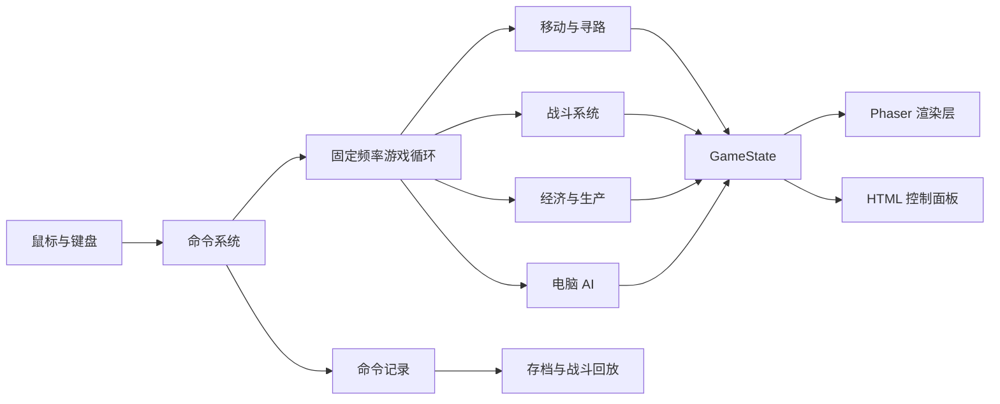

# Red Alert Web 设计指南

> 本文件是高层总览，各子系统的详细「设计意图 + 实现思路」见 [README.md](./README.md) 的文档导航。

## 1. 项目定位

这是一个受经典即时战略游戏启发的原创网页版 RTS 原型。目标不是一次性复刻完整商业游戏，而是从一场 10 分钟以内的单机遭遇战开始，逐步扩展到完整的资源、生产、战斗和 AI 系统。

游戏机制可以借鉴经典 RTS，但单位名称、阵营设定、地图、贴图、音乐和音效都应保持原创，不直接使用商业游戏素材。

## 2. 第一版最小可玩范围

第一版只实现一个完整的单机闭环：

- 一张 64×64 的等距地图
- 一个玩家阵营和一个电脑阵营
- 基地、兵营、战车工厂、矿场
- 步兵、坦克、采矿车三种单位
- 点击选择、框选、多选和右键移动
- 右键攻击、射程、射速、伤害和死亡
- 矿石、资金和生产队列
- 简单电脑 AI
- 摧毁敌方基地后胜利

暂时不实现联网对战、战役剧情、海军、空军、科技树、超级武器和复杂外交系统。

### 2.1 第一批可玩内容扩充

在最小闭环之上，当前版本已加入一组有明确战术分工的原创内容：

- 单位：步兵、火箭兵、坦克、重型坦克、侦察车、自行火炮、采矿车
- 建筑：基地、矿场、兵营、战车工厂、发电厂、警戒塔、雷达站
- 火箭兵克制重甲，侦察车拥有高速和远视野，自行火炮拥有远程攻城能力
- 警戒塔自动索敌，发电厂参与全局电力供需，雷达站扩大战争迷雾视野

这批内容的目标是让玩家在“步兵压制、装甲推进、远程火力、经济扩张、防御布置”之间产生第一层选择，而不是单纯堆叠同一种单位。

## 3. 技术方案

- TypeScript：游戏逻辑和数据结构
- Vite：开发服务器和构建工具
- Phaser：Canvas/WebGL 渲染、输入、摄像机和基础场景管理
- HTML/CSS：资金、电力、建造栏、单位信息等 HUD
- JSON/TypeScript 数据文件：单位、建筑、武器和地图配置

游戏世界使用 Phaser Canvas 渲染，UI 使用普通 HTML。不要为每个单位创建大量 DOM 元素。

## 4. 总体架构

核心原则：游戏规则与画面渲染分离。



建议游戏逻辑使用每秒 20～30 次的固定 tick，画面按照浏览器刷新率渲染。这样暂停、加速、存档、回放以及未来的联网同步会更容易实现。

## 5. 页面布局

```text
┌──────────────────────────────────────────────────────────┐
│ 金钱 $5000      电力 100/100                 菜单 / 暂停  │
├───────────────────────────────────────┬──────────────────┤
│                                       │ 建筑             │
│                                       │ [兵营] [矿场]    │
│            游戏地图 Canvas             │                  │
│                                       │ 单位             │
│                                       │ [步兵] [坦克]    │
│                                       │                  │
│  ┌──────────┐                         │ 当前选择信息     │
│  │  小地图  │                         │ 生命 / 攻击力    │
│  └──────────┘                         │                  │
└───────────────────────────────────────┴──────────────────┘
```

桌面端优先使用鼠标操作。移动端触控、双指缩放和虚拟按钮放在后续阶段实现。

## 6. 坐标与地图

游戏逻辑始终使用二维网格坐标，只有渲染时转换成等距坐标：

```ts
screenX = (tileX - tileY) * tileWidth / 2;
screenY = (tileX + tileY) * tileHeight / 2;
```

寻路、碰撞和建筑占用都在网格坐标中完成。渲染层负责将网格坐标转换为屏幕位置，并按照 y 值或图层排序绘制对象。

建议每个地图格保存以下信息：

```ts
type Tile = {
  terrain: 'grass' | 'water' | 'rock' | 'ore';
  walkable: boolean;
  buildable: boolean;
  occupiedBy?: number;
};
```

## 7. 核心数据结构

单位和建筑参数不要写死在系统代码中，应使用数据驱动：

```ts
type UnitDefinition = {
  id: string;
  name: string;
  cost: number;
  maxHp: number;
  speed: number;
  attackRange: number;
  attackDamage: number;
  reloadTicks: number;
  sprite: string;
};
```

运行中的实体只保存状态：

```ts
type UnitState = {
  id: number;
  type: string;
  ownerId: number;
  x: number;
  y: number;
  hp: number;
  command: UnitCommand | null;
  path: GridPoint[];
};
```

推荐的全局状态：

```ts
type GameState = {
  tick: number;
  map: MapState;
  players: PlayerState[];
  entities: Record<number, EntityState>;
  selectedEntityIds: number[];
  pendingCommands: GameCommand[];
};
```

## 8. 建议目录结构

```text
src/
  game/
    core/           游戏循环、时间、命令
    state/          GameState、实体状态
    systems/        移动、战斗、生产、AI
    pathfinding/    A*、地图占用
    render/         Phaser 场景和精灵
    input/          框选、右键命令
    data/           单位、建筑、武器配置
  ui/               HTML 控制面板
  assets/           地图、单位、音效
docs/
  design-guide.md   本设计指南
```

## 9. 分阶段实现顺序

### 阶段一：地图与摄像机

验收标准：能显示等距网格地图，支持拖动、滚轮缩放和边缘滚屏。

### 阶段二：单个单位移动

验收标准：点击选中一个单位，右键点击地图后，单位能移动到目标格。

### 阶段三：框选与寻路

加入拖拽框选、多单位移动、障碍物和 A* 寻路。单位到达相同目标附近时，应该自动分配不同落点。

### 阶段四：战斗闭环

加入攻击指令、射程检测、射速计时、弹道或命中效果、伤害、死亡和目标切换。

### 阶段五：基地经济（拆为两个子阶段）

- **五·A 资源与建筑放置**：矿石、采矿车、资金、建筑放置、建造费用。
- **五·B 生产队列与电力**：生产队列、电力供需与惩罚。

详细拆分见 [06-economy.md](./06-economy.md)。体量较大，两个子阶段可独立验收，避免一次做完拖太久。

### 阶段六：敌方 AI

先实现有限状态机：采矿、生产、防守、集结、进攻。不要一开始做复杂的通用 AI。

### 阶段七：战争迷雾与小地图

地图格分为未探索、已探索但不可见、当前可见三种状态；小地图只显示当前玩家已知信息。

### 阶段八：存档、回放与优化

保存初始地图和玩家命令，而不是每一帧都保存完整状态。大量寻路计算或地图分析可以在后期放到 Web Worker 中。

## 10. 需要提前避免的问题

- 不要让 Phaser 精灵对象直接保存全部游戏规则。
- 不要把寻路、伤害和经济逻辑写在鼠标事件回调里。
- 不要第一阶段就实现联网对战。
- 不要先制作大量素材，再验证核心操作手感。
- 不要让多个系统分别修改同一个资源数值；资金应由经济系统统一管理。
- 不要把屏幕像素坐标当作寻路坐标。

## 11. 分阶段实现入口

每个阶段的详细设计（目标、验收标准、设计意图、实现思路、风险）在独立文档里：

| 阶段 | 文档 |
| --- | --- |
| 总体架构与四条核心决策 | [01-architecture.md](./01-architecture.md) |
| 一：地图、等距坐标、摄像机 | [02-map-coordinates.md](./02-map-coordinates.md) |
| 二：单个单位移动 | [03-unit-movement.md](./03-unit-movement.md) |
| 三：框选、A* 寻路、落点分配 | [04-selection-pathfinding.md](./04-selection-pathfinding.md) |
| 四：战斗闭环 | [05-combat.md](./05-combat.md) |
| 五·A：资源与建筑放置 | [06-economy.md](./06-economy.md)（§A） |
| 五·B：生产队列与电力 | [06-economy.md](./06-economy.md)（§B） |
| 六：敌方 AI | [07-ai.md](./07-ai.md) |
| 七：战争迷雾与小地图 | [08-fog-minimap.md](./08-fog-minimap.md) |
| 八：存档、回放与优化 | [09-save-replay.md](./09-save-replay.md) |

第一阶段（地图与移动）的具体落点：先实现 `src/game/state/map.ts`（64×64 种子地图）→ `src/game/core/`（固定 tick 循环）→ `src/game/render/`（等距投影与摄像机）→ `src/game/input/`（点击、框选、右键命令），每步对应 [02](./02-map-coordinates.md) 到 [04](./04-selection-pathfinding.md) 的验收标准。
